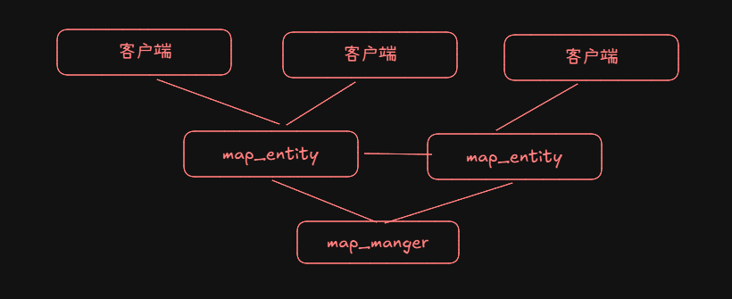

本代码仓库用于**网络同步研究demo**。

### 现状与目标

游戏中常用的同步方式是帧同步和状态同步两种。其中帧同步大多数用于房间类游戏。状态同步常用于存在大世界多人交互的mmorpg类的项目。

帧同步对于服务器而言工作内容较少，主要是采用 lockstep sync 即帧锁定同步。服务负责在一帧时间内，等待和收集客户端发送上来的帧，然后一次性同步给客户端，客户端根据服务器同送的帧不断推进计算。
- 优点是：服务器压力小，开发内容少，能够更好的利用游戏引擎支持物理效果。
- 缺点是：只适合存在时间较短的房间类游戏，且很难防止各种外挂

还有另一种方式的帧同步就是服务器只管转发，客户端根据帧发出的时间戳重新排序计算。需要额外处理插帧，超时帧丢弃等回滚重计算逻辑。常用于枪战类等FPS游戏，对公平性要求更高，操作先后判定不受网络延迟的影响。在lockstep sync中最多能够做到这一帧顺序正确，因为网络问题跨帧了则可能出现顺序与实际先后不一致。
- 优点是：判定顺序是根据真实世界时间顺序，计算结果更准确。
- 缺点是：对客户端性能要求高，算法复杂度会更高，回滚计算会额外消耗cpu, 本地会频繁备份镜像，对内存拷贝要求也更高

状态同步则是服务器计算和判定所有的输入，然后同步状态给客户端，客户端只做表现。适合二维地图类的mmorpg游戏。要想扩展到三维，开发复杂度则提升较大。
- 优点是：安全性更好，非房间类游戏唯一选择
- 缺点是：服务器成本高，后端开发难度大，游戏操作延迟高(一般通过设置技能冷却，前摇，后摇，客户端预测等等来优化)

本项目是探索mmorpg大世界同步计算的新思路，想解决目前常见状态同步服务器框架的一些痛点：
1. 无法真正支持多人大世界，常通过分服，分线解决，单张地图承载有限，不是真正的大世界
2. 技能实时性低，多人看到的内容一致性差。要么存在时差，要么因为客户端预测存在误差。如遥感移动误差，对多人打大型boss影响较大

### 效果展示

以下是本项目demo代码的效果展示：

### 分布式计算实现设想

1. 采用类似帧同步的方式进行计算，客户端遥感移动一致性极高
2. 客户端采用帧同步的方式进行计算，服务端也会同步进行计算，重新登录可以直接获得最新状态
3. 以玩家、NPC、怪物、整地图为entity作为计算单元，实现分布式部署

简单一句话就是：采用帧同步，但是将客户端搬到服务器作为map_entity. 然后map_entity与客户端之间同步表现即可

1. map_manger: 地图实例下的位置管理器，也可以立即为视野管理器。仅负责记录该地图下的所有entity的位置，按照块记录，并非精准坐标。主要用于：
    1. 视野选择，也就是选择玩家能够看到的对象(一般客户端会有视野对象上限)
    2. 技能范围选择(可能用途)。一般游戏技能选中存在上限限制，仅从视野对象选中即可。特殊的可能需要必须从范围内全部敌人中xx最低或者最高中选择，则需要走map_manger通知该技能范围以内的全部玩家
2. entity_manager: 负责所有实例的计算。根据hashcode分布式部署在指定的entity上。**可以简单的理解为运行在服务器上的客户端**

一些流程操作例子：

1. 登录
    1. 登录选择一个map_entity。选择后直到退出，都不需要变化
1. 进入地图
    1. 请求map_manger：更新位置。获得视野对象，通知对方需要同步给我
    2. 后续在位置发生块变化的时候：重复步骤1
1. 释放技能(范围或者单体)：
    1. map_entity1根据视野内的对象和技能配置，选择目标，将技能frame丢向对方map_entity2
    2. map_entity2以自己收到的时间为准，作为帧插入自己的framelist中
    3. 如果有吸血，击败反馈等等，对方map_entity2在计算后，同样丢一个反馈frame到map_entity1

这样整个单个地图实例的承载上限取决于 map_manager的性能上限，但是map_manager由只处理更新block位置这种低频率请求，所以承载上限极高。使用二维数组+hashmap来实现视野管理后，基本上承载上限只受网络框架限制。理论上承载10w不是问题